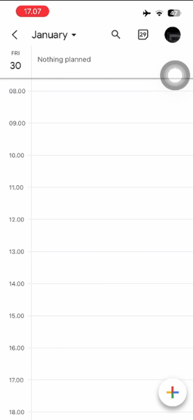
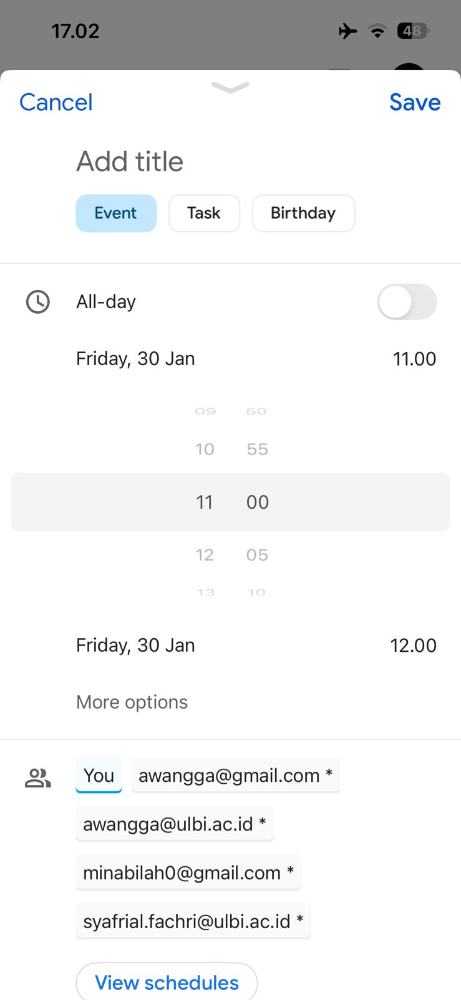
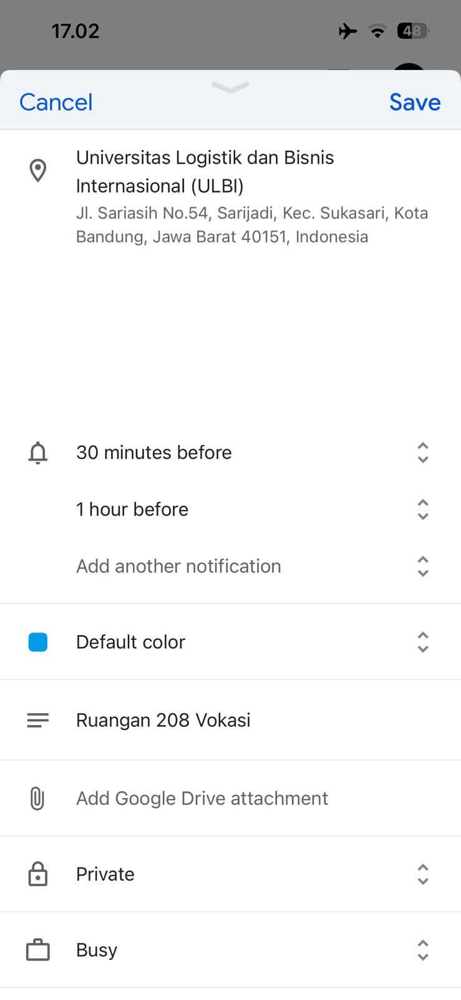
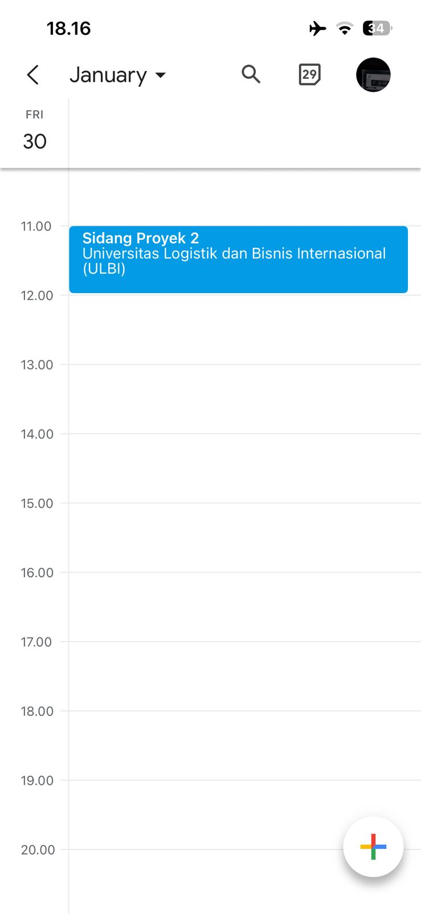

# Tutorial Membuat Jadwal di Google Calendar

Ikuti langkah-langkah di bawah ini untuk membuat jadwal baru:

### 1. Pilih Waktu
* Buka [Google Calendar](https://calendar.google.com/).
* Klik pada tanggal yang kamu inginkan di kalender.
* Lalu klik tombol **"+" (Create)** di pojok kiri bawah dan pilih **Event**.

> 

### 2. Isi Informasi & Undang Orang
* Masukkan **Judul** kegiatan.
* Masukkan jam sesuai dengan keperluan.
* Masukkan alamat email orang yang ingin diundang pada kolom **Add guests**.
* Masukkan semua informasi yang dibutuhkan.

> 

> 

### 3. Simpan
* Klik tombol **Save** di bagian kanan atas.

> 